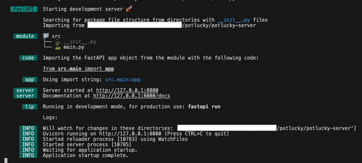

# Potlucky - A simple potluck planning website 

*Potlucky* makes organizing your next gathering with friends and family effortless. Create an event, build a list of items, and share a unique URL with your guests. They can easily contribute to the list, ensuring everyone brings something to the table. Start planning your potluck today by trying it out [here](https://pot-lucky.vercel.app)!

## Tech Stack

- **Frontend**: Tanstack (Router, Query, Form), React, Vite, Mantine
- **API**: FastAPI
- **Database**: DynamoDB


## Prequisites
- Node.js (latest)
- Python (3.10.12 minimum)
- An AWS Account

## Dev Setup

The project is split into two apps. The sections below will cover the setup process for each one.

- `/potlucky-server` - FastAPI server that handles HTTP requests
- `/potlucky-client` - React application (user interface)


### Server Setup

**1. Navigate to server directory**
```bash
cd potluck-server
```

**2. Setup DynamoDB in AWS**

- Create a DynamoDB table
- Create a group and attach a policy with the following permissions over that dynamodb table/resource:
    - `dynamodb:PutItem`
    - `dynamodb:DescribeTable`
    - `dynamodb:GetItem`
    - `dynamodb:UpdateItem`
- Create an IAM user under this group and generate access keys

**3. Configure the environment variables in `.env` using `.env.example` for reference**
- This assumes you have access and proper permissions for the project on AWS. 
- To set the AWS access and secret keys variables, you must create a new credential in the IAM section of your management console.
- The region and table name can be retrieved from the DyanmoDB page on AWS.

**4. Make a python virtual environment and install dependencies**

Ensure you have at least python 3.10.12 installed or some packages won't download correctly. If you need to upgrade, run the following command using the [pyenv](https://github.com/pyenv/pyenv) package manager:

```
pyenv install 3.10.12
```

To get the local server ready, first create a Python venv by running the commands below. This process creates a virtual environment in a `.venv` directory and activates it. Once you do this, your shell prompt will display a `(.venv)` prefix, confirming that the virtual environment is running. All subsequent `python`, `pip`, etc. commands will use the Python interpreter and packages associated with this isolated environment. Do note that that version of Python installed on your machine will be installed in the venv.

```bash
python3 -m venv .venv
source .venv/bin/activate
pip install -r requirements.txt
```

To deactivate the virtual environment, run the following command. Your python interpreter will also be reset to reference the system-wide Python installation on your machine.
```
deactivate
```

**5. Start the server**

```bash
fastapi dev src/main.py
```

You should see output logs that look like the image below. The server will provide an accessible link to view the available API endpoints via http://127.0.0.1:8000/docs



---


### Client Setup

**1. Navigate to client directory**
```bash
cd potluck-client
```

**2. Install dependencies**

This will create a new `node_modules` directory with the necessary node packages needed to run the React application.
```bash
npm install
```

**3. Create a new `.env` using `.env.example` as reference**

The `VITE_POTLUCKY_API_URL` should point to the FastAPI server running locally (e.g. `http://localhost:8000`)


**4. Start the client application**

```bash
npm run dev
```
